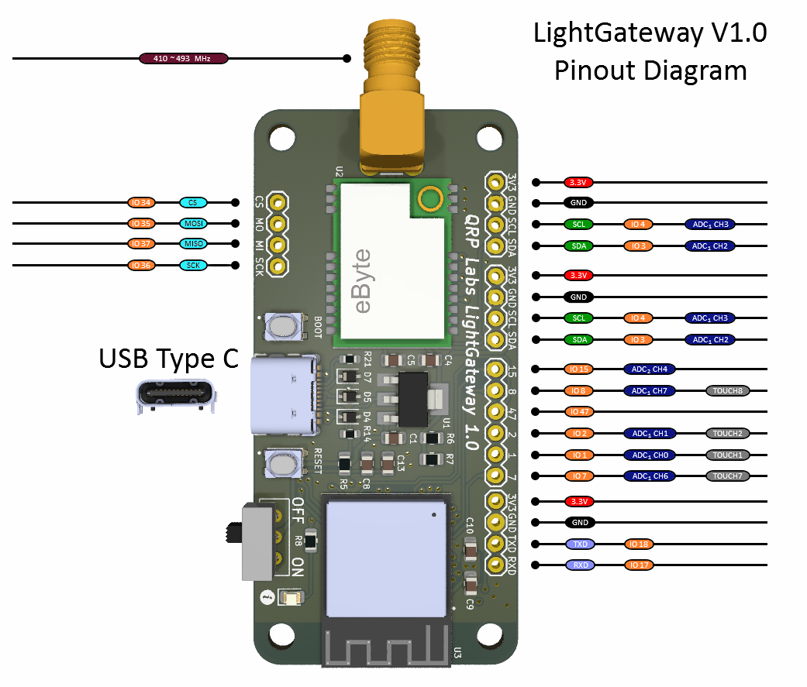
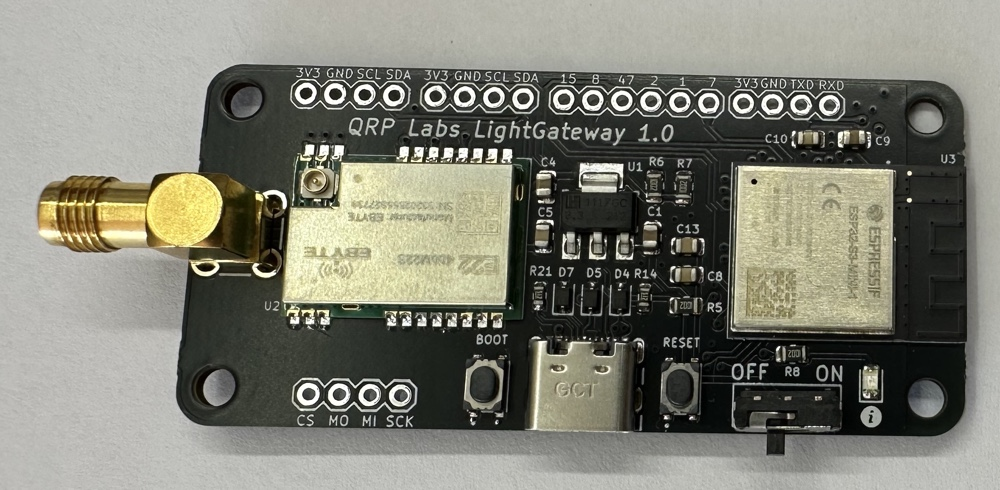
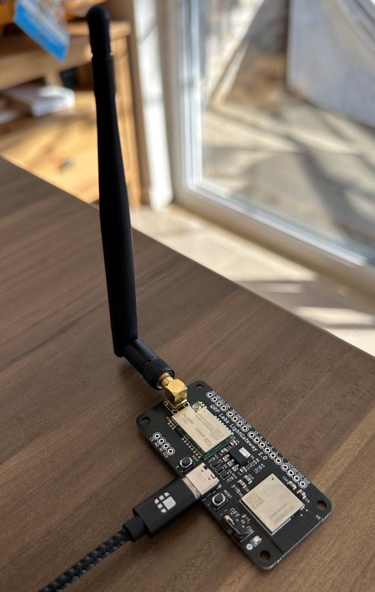

# LightGateway

LightGateway is an ESP32-based development board featuring a SX1268 (433MHz) LoRa module and 2 dBi 433 MHz SMA antenna.

LightGateway is available on https://shop.qrp-labs.com/aprs/LightGateway1 for order.

**Important :** LightGateway 1.0 operates on the amateur 70 cm (UHF) radio band with a 22 dBm output power, which typically requires an amateur radio license to operate in many countries. Therefore, if you are not a licensed HAM operator, please ensure to check local regulations and laws before purchasing the module.

## Key Benefits

- SX1268 (22 dBm) LoRa Radio Module
- 2 dBi 433 MHz SMA Antenna (included) 
- Suitable for Open Source HAM Radio ESP32 projects like Meshtastic, TinyGS, LoRa APRS iGate & Digipeater, etc
- Shipped with preloaded basic [LoRa APRS Software](https://github.com/lightaprs/LightLoRaAPRS/)(iGate or Digipeater) and supported by [Ricardo Guzman's LoRa APRS iGate Software](https://github.com/richonguzman/LoRa_APRS_iGate) You can use Web Flasher to install it -> [https://richonguzman.github.io/lora-tracker-web-flasher/installer.html](https://richonguzman.github.io/lora-igate-web-flasher/installer.html)
- Compatible with 0.96 inch OLED Screen (VCC,GND,SCL,SDA) support (OLED screen not included)

## Basic Features

- **Software** : Open Source
- **Weight** : 14 grams
- **Dimensions** : 74 mm x 32 mm x 14 mm
- **IDE** : Arduino & VSCode
- **Platform** : ESP32
- **CPU** : ESP32-S3 MINI
- **Flash** : 8 MB
- **Ram** : 512 kB SRAM
- **Operating Frequency** : 240 Mhz (Max)
- **Operating Voltage** : 3.3 Volt
- **Input Voltage** : 5 Volt via USB Type-C 2.0
- **Power Consumption (Idle)** : ~65 mA
- **LoRa Radio Module** : [EBYTE E22-400M22S](https://www.cdebyte.com/products/E22-400M22S) (SX1268)
- **LoRa Operating Frequency** : 410~493MHz (configurable by code)
- **LoRa Max Power** : 22dBm (configurable by code)
- **LoRa Power Consumption (TX)** : ~110 mA (22dBm)
- **Extended Pins** : I2C, I2S (in gpio pins, you can select random pins to use for I2S ), SPI,  10x GPIO Pin (includes SPI pins, 5x Analog pins, 4x Touch pins). Also I2C pins have Analog and Touch features.

## Support

If you have any questions or need support, please contact support@lightaprs.com

## Wiki

* **[F.A.Q.](https://github.com/lightaprs/LightGateway-1.0/wiki/F.A.Q.)**
